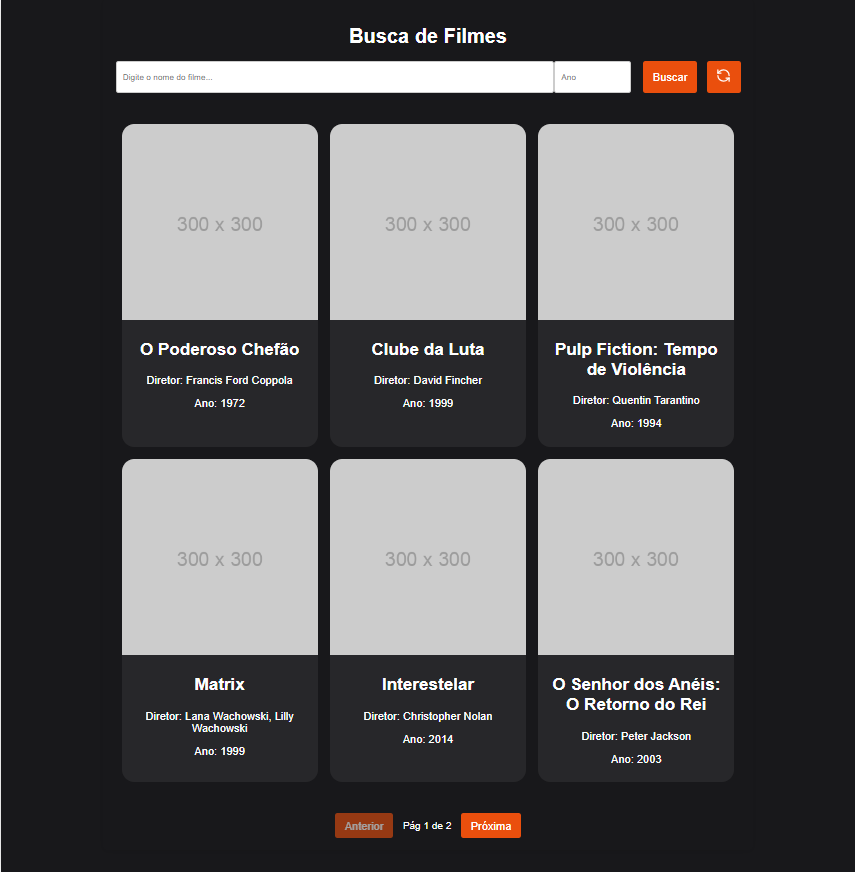
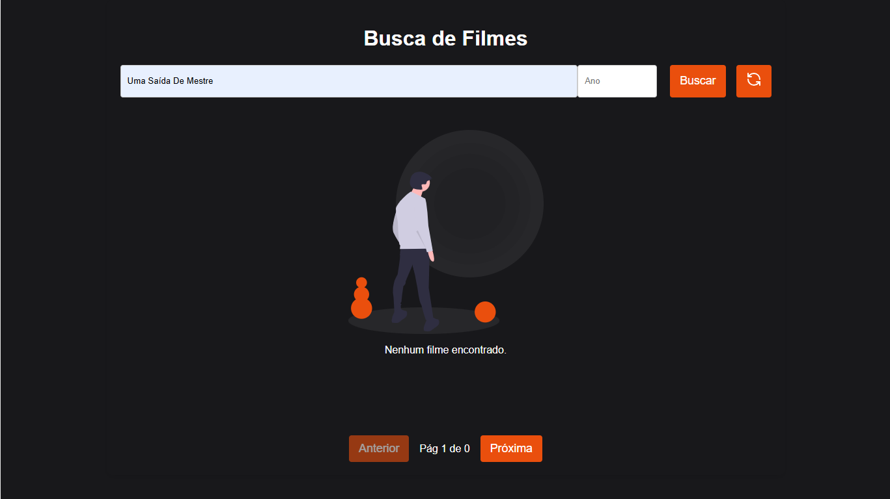
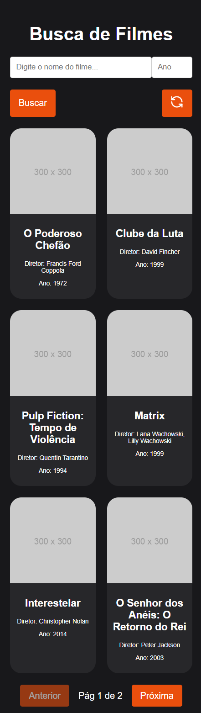
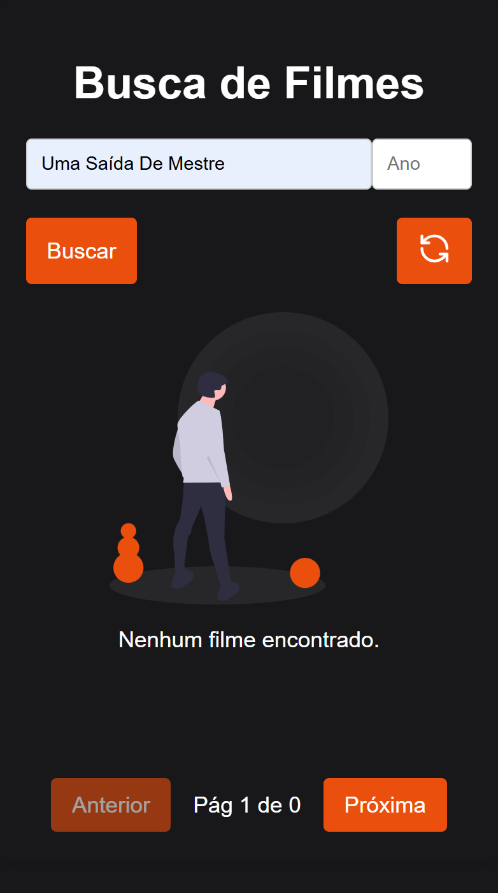

# Movie Catalog

Este projeto consiste em um catálogo de filmes com uma interface de busca. Ele é dividido em duas partes: um backend em Django e um frontend em React.

## Screenshots





## Requisitos

- Python 3.x
- Node.js
- npm ou yarn

## Backend (Django)

### Configuração


1. Navegue até a pasta do backend:
    ```bash
    cd backend
2. Crie um ambiente virtual (opcional, mas recomendado):
    ```bash
    python -m venv venv 

    # No Linux: 
    source venv/bin/activate 

    # No Windows:
    Set-ExecutionPolicy -Scope Process -ExecutionPolicy Bypass
    venv\Scripts\activate
3. Instale as dependências:
    ```bash
    pip install -r requirements.txt
4. Obtenha sua sua própria SECRET_KEY para o Django
    - Abrir o terminal do python
        ```bash
        python
    - Obtenha a chave
        ```bash
        import secrets 
        print(secrets.token_urlsafe(50))
        #Execute e copie a chave printada
    - Fechar o terminal python
        ```bash
        exit()
5. Configure as variáveis de ambiente:
Crie um arquivo `.env` na raiz do projeto backend e adicione:
    ```bash
    SECRET_KEY_DJANGO=sua_chave_secreta_aqui
6. Execute as migrações:
    ```bash
    python manage.py migrate
### Executando o servidor

- Para iniciar o servidor de desenvolvimento:
    ```bash
    python manage.py runserver`
O servidor estará disponível em `http://localhost:8000`.

## Frontend (React + Vite)

### Configuração

1. Navegue até a pasta do frontend:
    ```bash
    cd frontend
2. Instale as dependências:
- usando npm:
    ```bash
    npm install
- usando yarn:
    ```bash
    yarn install
### Executando o aplicativo

Para iniciar o servidor de desenvolvimento:
- usando npm:
    ```bash
    npm run dev
- usando yarn:
    ```bash
    yarn dev

O aplicativo estará disponível em `http://localhost:5173`.

## Uso

Após iniciar tanto o backend quanto o frontend, você pode acessar a aplicação no navegador através do endereço do frontend (`http://localhost:5173`). A interface permitirá que você busque filmes por título e ano.

## Notas Adicionais

- Certifique-se de que o backend esteja rodando antes de iniciar o frontend, pois o frontend faz requisições para a API do backend.
- O backend está configurado para aceitar requisições CORS do frontend rodando em `http://localhost:5173`.
- Para desenvolvimento, o modo DEBUG está ativado no backend. Lembre-se de desativá-lo em um ambiente de produção.
